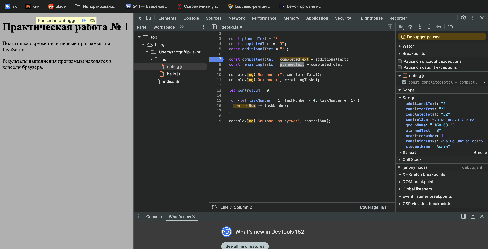

# Практика 1

## Автор и вариант
ФИО: Тарланов Аслан Эрзиманович
Группа: ЭФБО-03-25
Вариант 2

## Окружение

ОС: macOS
Версия node.js: v26.0.0
Версия npm: 11.12.1
Версия git: git version 2.50.1 (Apple Git-155)
Браузер: Comet Browser

## Запуск

### В Node.js нужно использовать команды:
node practice-01/js/hello.js
node practice-01/js/types.js
node practice-01/js/progress.js
node practice-01/js/plan.js
node practice-01/js/debug.js

### В браузере
1. Открыть `practice-01/index.html` в редакторе.
2. В атрибуте `src` тега `<script>` указать файл, который нужно запустить, например `./js/progress.js`.
3. Сохранить файл и открыть страницу в браузере.
4. Открыть DevTools и перейти на вкладку **Console**, где отображается вывод программы.

## Задание 1 
### Запуск hello.js

при запуске через терминал и через консоль браузера отличия вывода в строке "Тип document":
    в терминале вывод "Тип document: undefined"
    в консоли браузера вывод "Тип document: object"
совпадающе строки:
    Студент: Аслан
    Группа: ЭФБО-03-25
    Практическая работа: 1
    JavaScript успешно запущен

## Задание 2
### Запуск types.js

Результаты как в Node.js, так и в браузере аналогичны:

| Выражение | Ожидание до запуска | Фактическое значение | Тип результата | Объяснение |
|---|---|---|---|---|
| `"8" + 2` | Ошибка (нельзя сложить строку и число) | `"82"` | string | Если один из операндов `+` строка, второй преобразуется в строку и выполняется конкатенация, а не сложение. |
| `"8" - 2` | Ошибка (нельзя вычесть число из строки) | `6` | number | У оператора `-` нет строкового варианта, поэтому строка `"8"` преобразуется в число 8. |
| `Number("8") + 2` | `10` | `10` | number | `Number("8")` явно даёт число 8, дальше обычное сложение чисел. |
| `"12" > "3"` | `false` | `false` | boolean | Обе стороны строки, поэтому сравнение лексикографическое, посимвольно: `"1"` < `"3"`, значит `"12"` меньше `"3"`. |
| `12 === "12"` | `false` | `false` | boolean | Строгое равенство не приводит типы; number и string разные типы. |
| `Number("")` | `0` | `0` | number | Пустая строка (и строка из одних пробелов) при преобразовании в число даёт 0. |
| `Number("text")` | `NaN` | `NaN` | number | Строку нельзя разобрать как число, результат `NaN` («Not a Number»), который при этом относится к типу number. |
| `Boolean("false")` | `true` | `true` | boolean | Ложна только пустая строка; любая непустая строка истинна, её содержимое не важно. |
| `typeof null` | `"object"` | `"object"` | string | `typeof` всегда возвращает строку. Значение `"object"` для `null` — историческая ошибка языка, сохранённая ради совместимости. |
| `typeof NaN` | `"number"` | `"number"` | string | `NaN` — специальное значение числового типа, поэтому `typeof` даёт `"number"`, а сам результат является строкой. |

## Задание 3. 

### Описание решения

Файл `practice-01/js/progress.js` проверяет входные данные цепочкой условий `if / else if`, после чего рассчитывает количество оставшихся задач, процент выполнения и статус.

### Результаты проверок

| Проверка | Входные данные | Ожидаемый результат | Фактический результат | Итог |
|---|---|---|---|---|
| Обычный случай | `totalTasks = 12`, `completedTasks = 5` | Осталось 7; 41.7%; «В работе» | Осталось: 7, Прогресс: 41.7%, Статус: В работе | Пройдено |
| Граничный случай: задач нет | `totalTasks = 0`, `completedTasks = 0` | «Задач пока нет» | Задач пока нет | Пройдено |
| Граничный случай: работа не начата | `totalTasks = 5`, `completedTasks = 0` | Осталось 5; 0.0%; «Не начато» | Осталось: 5, Прогресс: 0.0%, Статус: Не начато | Пройдено |
| Граничный случай: всё выполнено | `totalTasks = 5`, `completedTasks = 5` | Осталось 0; 100.0%; «Завершено» | Осталось: 0, Прогресс: 100.0%, Статус: Завершено | Пройдено |
| Некорректные данные: выполнено больше | `totalTasks = 5`, `completedTasks = 6` | Ошибка: выполнено больше | Ошибка: выполнено больше, чем существует. | Пройдено |
| Некорректные данные: отрицательное число | `totalTasks = -1`, `completedTasks = 0` | Ошибка: отрицательное количество | Ошибка: отрицательное количество. | Пройдено |
| Некорректные данные: дробное число | `totalTasks = 5`, `completedTasks = 2.5` | Ошибка: дробное количество | Ошибка: дробное количество. | Пройдено |
| Некорректные данные: строка | `totalTasks = "5"`, `completedTasks = 2` | Ошибка: строка вместо числа | Ошибка: вместо числа передана строка или другой тип. | Пройдено |
| Некорректные данные: превышена граница | `totalTasks = 1001`, `completedTasks = 0` | Ошибка: превышена граница | Ошибка: превышена верхняя граница (максимум 1000). | Пройдено |
| Некорректные данные: NaN | `totalTasks = NaN`, `completedTasks = 0` | Ошибка: недопустимое число | Ошибка: недопустимое числовое значение. | Пройдено |

### Вывод индивидуального варианта (26 в списке вариант 2)

| totalTasks | completedTasks | Ожидаемое поведение | Фактический вывод | 
|---|---|---|---|
| `15` | `0` | Осталось: 15; 0.0%; «Не начато» | Осталось: 15, Прогресс: 0.0%, Статус: Не начато |

## Задание 4

### Описание решения

Файл `practice-01/js/plan.js` проверяет входные данные цепочкой условий `if / else if`, после чего рассчитывает количество оставшихся задач, количество дней понадобивших на выполнение всех и количество выполненых задач выполненых за каждый из дней.

### результаты проверок

| Проверка | Входные данные | Ожидаемый результат | Фактический результат | Итог |
|---|---|---|---|---|
| Обычный случай: неполный последний день | `totalTasks = 12`, `completedTasks = 5`, `dailyLimit = 3` | 3 дня; в последний день выполнена 1 задача | Осталось задач: 7; День 1: выполнено 3, осталось 4; День 2: выполнено 3, осталось 1; День 3: выполнено 1, осталось 0; Потребуется дней: 3 | Пройдено |
| Обычный случай: полные дни | `totalTasks = 10`, `completedTasks = 4`, `dailyLimit = 3` | 2 дня, по 3 задачи в день | Осталось задач: 6; День 1: выполнено 3, осталось 3; День 2: выполнено 3, осталось 0; Потребуется дней: 2 | Пройдено |
| Граничный случай: норма больше остатка | `totalTasks = 5`, `completedTasks = 3`, `dailyLimit = 10` | 1 день, выполнено только 2 оставшиеся задачи | Осталось задач: 2; День 1: выполнено 2, осталось 0; Потребуется дней: 1 | Пройдено |
| Граничный случай: всё выполнено | `totalTasks = 5`, `completedTasks = 5`, `dailyLimit = 2` | 0 дней; цикл не выполняется | 0 дней; цикл не выполняется | Пройдено |
| Граничный случай: задач нет | `totalTasks = 0`, `completedTasks = 0`, `dailyLimit = 2` | 0 дней; цикл не выполняется | 0 дней; цикл не выполняется | Пройдено |
| Некорректные данные: нулевая норма | `totalTasks = 5`, `completedTasks = 2`, `dailyLimit = 0` | Ошибка; цикл не запускается | Ошибка; цикл не запускается | Пройдено |
| Некорректные данные: дробная норма | `totalTasks = 5`, `completedTasks = 2`, `dailyLimit = 1.5` | Ошибка: дробной дневной нормы быть не должно | Ошибка: дробной дневной нормы быть не должно | Пройдено |
| Некорректные данные: выполнено больше | `totalTasks = 5`, `completedTasks = 6`, `dailyLimit = 2` | Ошибка: некорректное число выполненных задач | Ошибка: некорректное число выполненных задач | Пройдено |
| Некорректные данные: строка | `totalTasks = 5`, `completedTasks = 2`, `dailyLimit = "2"` | Ошибка: дневная норма задана строкой | Ошибка: дневная норма задана строкой | Пройдено |
| Некорректные данные: превышена граница | `totalTasks = 5`, `completedTasks = 2`, `dailyLimit = 1001` | Ошибка: превышена верхняя граница нормы | Ошибка: превышена верхняя граница нормы | Пройдено |

### Вывод индивидуального варианта (26 в списке вариант 2)

| `totalTasks` | `completedTasks` | `dailyLimit` | Ожидаемое поведение | Фактический вывод |
|---:|---:|---:|---|---|
| `15` | `0` | `4` | 4 дня; в последний день выполнена 3 задачи. | Осталось задач: 15; День 1: выполнено 4, осталось 11; День 2: выполнено 4, осталось 7; День 3: выполнено 4, осталось 3; День 4: выполнено 3, осталось 0; Потребуется дней: 4 |

## Задание 5

### Исходный результат

Выполнено: 32
Осталось: -24
Контрольная сумма: 6

| Ошибка | Что наблюдалось | Причина | Исправление | Результат после исправления |
|---|---|---|---|---|
| Обработка количества задач | Результат `Выполнено: "32"; Осталось: -24`, вместо `Выполнено: 5; Осталось: 3` | Значения `"3"`, `"2"` и `"8"` были строками и склеивались | Изменить тип данных со `string` на `number` с помощью `Number()`| Выполнено: `5`, осталось: `3` |
| Граница цикла | Контрольная сумма была `6` | Цикл выполнялся только для значений от 1 до 3 | Условие `< 4` изменяется на `<= 4` | Контрольная сумма: `10` |

### Результат после исправления

Выполнено: 5
Осталось: 3
Контрольная сумма: 10

## Дополнительное задание

| totalTasks | completedTasks | dailyLimit | Результат |
|---:|---:|---:|---|
| 6 | 0 | 2 | Потребуется 3 рабочих и 3 календарных дней |
| 12 | 0 | 1 | Потребуется 12 рабочих и 16 календарных дней |
| 14 | 3 | 5 | Потребуется 3 рабочих и 3 календарных дней |

## Вывод

В ходе работы было настроено окружение для JavaScript, программы запускались в Node.js и в браузере. Я изучил неявное преобразование типов, написал программы расчёта прогресса и плана задач с проверкой входных данных, а с помощью отладчика DevTools нашёл и исправил логические ошибки. Работа показала, что отсутствие ошибок при запуске ещё не гарантирует правильный результат, поэтому данные нужно проверять, а код тестировать на обычных, граничных и некорректных случаях.